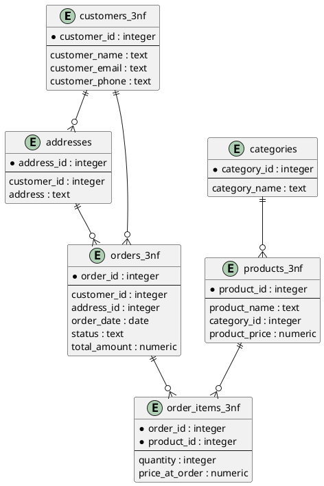

# ИДЗ-1. PostgreSQL: структуры данных, нормализация и денормализация

**Выполнил**: Некрасов Богдан<br>
**Группа**: Р4150<br>
**PostgreSQL**: 18.3

## Часть 1 - Ненормализованная таблица (UNF)

Создаем исходную таблицу ```orders_raw```, которая хранит данные в денормализованном виде.
```sql
CREATE TABLE orders_raw (
    order_id INTEGER,
    order_date DATE,
    customer_name TEXT,
    customer_email TEXT,
    customer_phone TEXT,
    delivery_address TEXT,
    product_names TEXT,
    product_prices TEXT,
    product_quantities TEXT,
    total_amount NUMERIC,
    status TEXT
);
```
После создания таблицы выполняем скрипт ```generate_data.sql```. Этот скрипт генерирует тестовые данные.
```sql
INSERT INTO orders_raw (
    order_id,
    order_date,
    customer_name,
    customer_email,
    customer_phone,
    delivery_address,
    product_names,
    product_prices,
    product_quantities,
    total_amount,
    status
)
SELECT
    gs AS order_id,
    DATE '2024-01-01' + (gs % 365),
    'Клиент ' || gs,
    'client' || gs || '@mail.ru',
    '+7999' || LPAD(gs::text, 7, '0'),
    'Город, улица ' || gs,
    CASE
        WHEN gs % 3 = 0 THEN 'Ноутбук, Мышь, Коврик'
        WHEN gs % 3 = 1 THEN 'Монитор, Кабель HDMI'
        ELSE 'Клавиатура, Мышь'
    END,
    CASE
        WHEN gs % 3 = 0 THEN '85000, 1500, 500'
        WHEN gs % 3 = 1 THEN '22000, 900'
        ELSE '3500, 1200'
    END,
    CASE
        WHEN gs % 3 = 0 THEN '1, 1, 2'
        WHEN gs % 3 = 1 THEN '1, 2'
        ELSE '1, 1'
    END,
    CASE
        WHEN gs % 3 = 0 THEN 87500
        WHEN gs % 3 = 1 THEN 23800
        ELSE 4700
    END,
    CASE
        WHEN gs % 4 = 0 THEN 'new'
        WHEN gs % 4 = 1 THEN 'processing'
        WHEN gs % 4 = 2 THEN 'shipped'
        ELSE 'delivered'
    END
FROM generate_series(1, 1000) AS gs;
```

### Аномалии

**Аномалия вставки**: нельзя добавить информацию о товаре отдельно от заказа.
Например, невозможно сохранить товар "Наушники" с ценой 3000, если ещё нет конкретного заказа, покупателя и даты заказа.

---
**Аномалия обновления**: данные клиента дублируются в нескольких строках.
Если у клиента изменился email или телефон, нужно обновлять все его заказы.
Если часть строк останется со старым значением, в базе возникнет несогласованность.

---
**Аномалия удаления**: при удалении строки заказа теряется не только сам заказ, но и связанная информация о клиенте, адресе доставки и товарах.
Если клиент или товар встречались только в одном заказе, их данные исчезнут полностью.

## Часть 2 - Нормализация до 3NF

### 1NF — атомарность

- Были созданы таблицы:<br>
```orders_1nf``` - хранит информацию о заказе (дата, имя клиента, почта, номер телефона, адрес, сумма заказа, статус)<br>
```order_items_1nf``` - хранит информацию о товарах заказа (название, цена, количество)

| Было                  | Стало                    |
| --------------------- | ------------------------ |
| список товаров в поле | одна строка = один товар |
| product_names         | product_name             |
| product_prices        | product_price            |
| product_quantities    | product_quantity         |

<br>

Выборка из ***orders_1nf*** (выборка из 10)
|order_id | order_date | customer_name |  customer_email   | customer_phone | delivery_address | total_amount | status|
|---------|------------|---------------|-------------------|----------------|------------------|--------------|------------|
|22 | 2024-01-23 | Клиент 22     | client22@mail.ru  | +79990000022   | Город, улица 22  |        23800 | shipped|
|507 | 2024-05-22 | Клиент 507    | client507@mail.ru | +79990000507   | Город, улица 507 |        87500 | delivered|
|381 | 2024-01-17 | Клиент 381    | client381@mail.ru | +79990000381   | Город, улица 381 |        87500 | processing|
|450 | 2024-03-26 | Клиент 450    | client450@mail.ru | +79990000450   | Город, улица 450 |        87500 | shipped|
|616 | 2024-09-08 | Клиент 616    | client616@mail.ru | +79990000616   | Город, улица 616 |        23800 | new|
|462 | 2024-04-07 | Клиент 462    | client462@mail.ru | +79990000462   | Город, улица 462 |        87500 | shipped|
|684 | 2024-11-15 | Клиент 684    | client684@mail.ru | +79990000684   | Город, улица 684 |        87500 | new|
|852 | 2024-05-02 | Клиент 852    | client852@mail.ru | +79990000852   | Город, улица 852 |        87500 | new|
|378 | 2024-01-14 | Клиент 378    | client378@mail.ru | +79990000378   | Город, улица 378 |        87500 | shipped|
|973 | 2024-08-31 | Клиент 973    | client973@mail.ru | +79990000973   | Город, улица 973 |        23800 | processing|

Выборка из ***order_items_1nf*** (выборка из 10)
|order_id | product_name | product_price | product_quantity |
|----------|--------------|---------------|------------------|
|1 | Монитор      |         22000 |1|
|1 | Кабель HDMI  |           900 |2|
|2 | Клавиатура   |          3500 |1|
|2 | Мышь         |          1200 |1|
|3 | Ноутбук      |         85000 |1|
|3 | Мышь         |          1500 |1|
|3 | Коврик       |           500 |2|
|4 | Монитор      |         22000 |1|
|4 | Кабель HDMI  |           900 |2|
|5 | Клавиатура   |          3500 |1|

### 2NF — устранение частичных зависимостей

Были выделены отдельные сущности:<br>
```
customers (имя, почта, телефон, адрес)
products (название, цена)
orders (дата, id клиента, сумма, статус)
order_items (id продукта, количество)
```
Были устранены следующие зависимости:<br>
1. Атрибут product_price зависел только от товара. Если бы цена изменилась, нужно обновить множество строк, так как цена дублировалась во всех заказах.

Теперь информация о товаре вынесена в таблицу ```products```.

Выборка из ***products***:
|product_id | product_name | product_price |
|-----------|-------------|---------------|
|          1 | Мышь         |          1500|
|          2 | Клавиатура   |          3500|
|          3 | Коврик       |           500|
|          4 | Монитор      |         22000|
|          5 | Ноутбук      |         85000|
|          6 | Мышь         |          1200|
|          7 | Кабель HDMI  |           900|

2. В таблице ```orders_1nf``` информация о клиенте хранится вместе с заказом. При изменении данных клиента пришлось бы обновлять много строк.

Теперь информация о клиенте вынесена в таблицу ```customers```.

Выборка из ***customers***
|customer_id | customer_name |  customer_email   | customer_phone | delivery_address |
|-------------|---------------|-------------------|----------------|------------------|
|           1 | Клиент 548    | client548@mail.ru | +79990000548   | Город, улица 548|
|           2 | Клиент 880    | client880@mail.ru | +79990000880   | Город, улица 880|
|           3 | Клиент 282    | client282@mail.ru | +79990000282   | Город, улица 282|
|           4 | Клиент 935    | client935@mail.ru | +79990000935   | Город, улица 935|
|           5 | Клиент 279    | client279@mail.ru | +79990000279   | Город, улица 279|

3. Вместо хранения товаров в таблице заказа была выделена таблица ```order_items```, что позволило хранить несколько товаров в одном заказе и устранить дублирование данных.

Выборка из ***order_items***
|order_id | product_id | product_quantity |
|----------|------------|------------------|
|        1 |          4 |                1|
|        1 |          7 |                2|
|        2 |          2 |                1|
|        2 |          6 |                1|
|        3 |          5 |                1|
|        3 |          1 |                1|

Выборка из ***orders***
| order_id | order_date | customer_id | total_amount |   status   |
|----------|------------|-------------|--------------|------------|
|       22 | 2024-01-23 |         595 |        23800 | shipped|
|      507 | 2024-05-22 |         392 |        87500 | delivered|
|      381 | 2024-01-17 |         999 |        87500 | processing|
|      450 | 2024-03-26 |         787 |        87500 | shipped|
|      616 | 2024-09-08 |         857 |        23800 | new|
|      462 | 2024-04-07 |         928 |        87500 | shipped|
|      684 | 2024-11-15 |         804 |        87500 | new|

### 3NF — устранение транзитивных зависимостей

1. После 2NF таблица ```customers``` имеет структуру:
```
customer_id
customer_name
customer_email
customer_phone
delivery_address
```
Зависимость:
```customer_id → delivery_address```.<br>
Но клиент может иметь несколько адресов.

Поэтому я выделил отдельную сущность ```addresses``` в которой следующая структура:<br>
```
address_id
customer_id
address
```
Теперь зависимости:

```
customer_id → customer_name, customer_email, customer_phone
address_id → address
```

Выборка из ***addresses***
| address_id | customer_id |     address      |
|------------|-------------|------------------|
|          1 |           1 | Город, улица 91|
|          2 |           2 | Город, улица 495|
|          3 |           3 | Город, улица 34|
|          4 |           4 | Город, улица 794|
|          5 |           5 | Город, улица 797|
|          6 |           6 | Город, улица 952|
|          7 |           7 | Город, улица 725|

2. В исходных данных у нас не было категорий. Поэтому на этом этапе я искусственно создал сущность ```categories (category_id, category_name)``` со значениями Компьютерная техника, Периферия, Аксессуары. 

После этого таблица ```products_3nf``` стала иметь внешний ключ:
```
product_id
product_name
category_id (FK)
product_price
```
Выборка из ***products_3nf***
| product_id | product_name | category_id | product_price |
|------------|--------------|-------------|---------------|
|          1 | Мышь         |           2 |          1500|
|          2 | Клавиатура   |           2 |          3500|
|          3 | Коврик       |           3 |           500|
|          4 | Монитор      |           2 |         22000|
|          5 | Ноутбук      |           1 |         85000|
|          6 | Мышь         |           2 |          1200|
|          7 | Кабель HDMI  |           3 |           900|

#### ER-диаграмма итоговой 3NF-схемы


## Часть 3 - OLTP-нагрузка на нормализованной схеме

1. **Создание заказа** - транзакция с INSERT в orders + order_items, с проверкой наличия товара (использовать SELECT ... FOR UPDATE).
```sql
-- Проверяем и блокируем товар
SELECT *
FROM products_3nf
WHERE product_id = 1
FOR UPDATE;

-- Создаем заказ
INSERT INTO orders_3nf (order_id, customer_id, address_id, order_date, status, total_amount)
VALUES (1001, 1, 1, CURRENT_DATE, 'new', 1500);

-- Добавляем позицию заказа
INSERT INTO order_items_3nf (order_id, product_id, quantity, price_at_order)
VALUES (1001, 1, 1, 1500);

COMMIT;
```

*План выполнения для ```SELECT ... FOR UPDATE```*
```
 product_id | product_name | category_id | product_price 
------------+--------------+-------------+---------------
          1 | Мышь         |           2 |          1500
LockRows
   ->  Index Scan using products_3nf_pkey on products_3nf
 Execution Time: 0.062 ms
 ```

 *План выполнения для ```INSERT INTO orders_3nf```*
 ```
 Insert on orders_3nf
   ->  Result
 Trigger for constraint orders_3nf_customer_id_fkey: time=0.048 calls=1
 Trigger for constraint orders_3nf_address_id_fkey: time=0.021 calls=1
 Execution Time: 0.096 ms
 ```

  *План выполнения для ```INSERT INTO order_items_3nf```*
  ```
   Insert on order_items_3nf
   ->  Result
 Trigger for constraint order_items_3nf_order_id_fkey: time=0.023 calls=1
 Trigger for constraint order_items_3nf_product_id_fkey: time=0.018 calls=1
 Execution Time: 0.054 ms
  ```
При создании заказа выполнена транзакция, включающая проверку товара через SELECT ... FOR UPDATE, вставку записи в orders_3nf и вставку позиции в order_items_3nf.
EXPLAIN ANALYZE показал, что поиск товара выполняется через Index Scan по первичному ключу products_3nf_pkey, после чего применяется блокировка строки (LockRows).
Вставка заказа и позиции заказа сопровождается проверкой внешних ключей (customer_id, address_id, order_id, product_id).

2. **Обновление статуса** — UPDATE orders SET status = 'shipped'

```sql
UPDATE orders_3nf
SET status = 'shipped'
WHERE order_id = 1;
```

*План выполнения:*
```
 Update on orders_3nf
   ->  Index Scan using orders_3nf_pkey on orders_3nf
 Execution Time: 0.070 ms
 ```
Выполняется обновление записи в таблице orders_3nf.
Для поиска нужного заказа используется индекс по первичному ключу orders_3nf_pkey, что позволило найти строку с order_id = 1.

После нахождения записи выполняется её обновление.

3. **Получение заказа** — SELECT с JOIN по 4 таблицам (order + customer + items + products)

```sql
SELECT
    o.order_id,
    o.order_date,
    o.status,
    o.total_amount,
    c.customer_name,
    c.customer_email,
    p.product_name,
    oi.quantity,
    oi.price_at_order
FROM orders_3nf o
JOIN customers_3nf c
    ON c.customer_id = o.customer_id
JOIN order_items_3nf oi
    ON oi.order_id = o.order_id
JOIN products_3nf p
    ON p.product_id = oi.product_id
WHERE o.order_id = 1;
```
*План выполнения:*
```
 order_id | order_date | status  | total_amount | customer_name | customer_email  | product_name | quantity | price_at_order 
----------+------------+---------+--------------+---------------+-----------------+--------------+----------+----------------
        1 | 2024-01-02 | shipped |        23800 | Клиент 1      | client1@mail.ru | Монитор      |        1 |          22000
        1 | 2024-01-02 | shipped |        23800 | Клиент 1      | client1@mail.ru | Кабель HDMI  |        2 |            900
Nested Loop
   ->  Nested Loop
         ->  Index Scan using orders_3nf_pkey on orders_3nf o
         ->  Index Scan using customers_3nf_pkey on customers_3nf c
   ->  Nested Loop
         ->  Index Scan using order_items_3nf_pkey on order_items_3nf oi
         ->  Index Scan using products_3nf_pkey on products_3nf p
 Execution Time: 0.033 ms
```
Запрос на получение заказа использует JOIN таблиц orders_3nf, customers_3nf, order_items_3nf и products_3nf. В результате были получены данные о заказе, клиенте и двух товарных позициях. План выполнения показывает использование Nested Loop и Index Scan по первичным ключам

4. Отчёт «топ-10 товаров» — GROUP BY + ORDER BY + LIMIT

```sql
SELECT
    p.product_id,
    p.product_name,
    SUM(oi.quantity) AS total_sold
FROM order_items_3nf oi
JOIN products_3nf p
    ON p.product_id = oi.product_id
GROUP BY p.product_id, p.product_name
ORDER BY total_sold DESC
LIMIT 10;
```

*План выполнения:*

```
 product_id | product_name | total_sold 
------------+--------------+------------
          7 | Кабель HDMI  |        668
          3 | Коврик       |        666
          1 | Мышь         |        335
          4 | Монитор      |        334
          2 | Клавиатура   |        333
          5 | Ноутбук      |        333
          6 | Мышь         |        333

 Limit  
   ->  Sort
         Sort Key: (sum(oi.quantity)) DESC
         ->  HashAggregate
               Group Key: p.product_id
               ->  Hash Join
                     Hash Cond: (oi.product_id = p.product_id)
                     ->  Seq Scan on order_items_3nf oi
                     ->  Hash
                           ->  Seq Scan on products_3nf p
 Execution Time: 0.682 ms
```
Выполняется последовательное чтение таблиц order_items_3nf и products_3nf (Seq Scan) и соединение их через Hash Join. Затем выполняется агрегирование (HashAggregate) и сортировка (Sort) для определения самых популярных товаров.

5. Поиск клиента
- по email

```sql
SELECT
    customer_id,
    customer_name,
    customer_email,
    customer_phone
FROM customers_3nf
WHERE customer_email = 'client1@mail.ru';
```

*План выполнения:*
```
 customer_id | customer_name | customer_email  | customer_phone 
-------------+---------------+-----------------+----------------
          81 | Клиент 1      | client1@mail.ru | +79990000001

 Seq Scan on customers_3nf
   Filter: (customer_email = 'client1@mail.ru'::text)
   Rows Removed by Filter: 999
 Execution Time: 0.063 ms
```
Выполняется последовательное чтение таблицы (Seq Scan), так как индекс по полю customer_email будет создан в части 4.
База данных просмотрела 1000 строк, из которых 999 были отброшены фильтром, и нашла одну подходящую запись.

- по подстроке имени (LIKE / ILIKE)

```sql
SELECT
    customer_id,
    customer_name,
    customer_email,
    customer_phone
FROM customers_3nf
WHERE customer_name ILIKE '%Клиент 1%';
```

*План выполнения:*
```
 customer_id | customer_name |   customer_email   | customer_phone 
-------------+---------------+--------------------+----------------
          34 | Клиент 155    | client155@mail.ru  | +79990000155
          50 | Клиент 104    | client104@mail.ru  | +79990000104
          74 | Клиент 197    | client197@mail.ru  | +79990000197
          80 | Клиент 11     | client11@mail.ru   | +79990000011
          81 | Клиент 1      | client1@mail.ru    | +79990000001
...
(112 rows)
Seq Scan on customers_3nf
   Filter: (customer_name ~~* '%Клиент 1%'::text)
   Rows Removed by Filter: 888
 Execution Time: 0.511 ms
```
Выполняется последовательное чтение таблицы (Seq Scan), поскольку поиск по шаблону с ведущим символом % не может использовать обычный индекс.
База данных проверяет каждую строку таблицы и применяет фильтр ILIKE

## Часть 4 - Индексы

### Поиск клиента по email
```sql
SELECT
    customer_id,
    customer_name,
    customer_email,
    customer_phone
FROM customers_3nf
WHERE customer_email = 'client1@mail.ru';
```

- Вывод ДО индекса:
```
 Seq Scan on customers_3nf
   Filter: (customer_email = 'client1@mail.ru'::text)
   Rows Removed by Filter: 999
   Buffers: shared hit=3 read=8
 Planning:
   Buffers: shared hit=78
 Execution Time: 1.338 ms
```

До создания индекса выполняется ```Seq Scan```, то есть просматривается вся таблица ```customers_3nf```.
В выводе видно, что было просмотрено 1000 строк и 999 из них были отброшены фильтром.

- Вывод ПОСЛЕ добавления индекса 
```sql 
CREATE INDEX idx_customers_3nf_email 
ON customers_3nf(customer_email);
```

```
Index Scan using idx_customers_3nf_email on customers_3nf
   Index Cond: (customer_email = 'client1@mail.ru'::text)
   Index Searches: 1
   Buffers: shared hit=1 read=2
 Planning:
   Buffers: shared hit=16 read=1
 Execution Time: 0.038 ms
```
После создания индекса по ```customer_email``` план выполнения изменился на Index Scan.
Теперь PostgreSQL сразу находит нужную строку через индекс, не просматривая всю таблицу.

Уменьшилось время выполнения запроса:
с ~1.3 ms до ~0.03 ms.

### Поиск клиента по подстроке имени

```sql
SELECT
    customer_id,
    customer_name,
    customer_email,
    customer_phone
FROM customers_3nf
WHERE customer_name ILIKE '%Клиент 1%';
```

- Вывод ДО индекса:
```
 Seq Scan on customers_3nf
   Filter: (customer_name ~~* '%Клиент 1%'::text)
   Rows Removed by Filter: 888
   Buffers: shared hit=11
 Planning:
   Buffers: shared hit=2
 Planning Time: 0.688 ms
 Execution Time: 0.505 ms
```

При поиске клиента по подстроке имени ```ILIKE '%Клиент 1%'``` выполняется ```Seq Scan```, то есть просматривается вся таблица ```customers_3nf```.

- Вывод ПОСЛЕ добавления индекса:
```sql
-- создаем индекс
CREATE INDEX idx_customers_3nf_name_btree
ON customers_3nf(customer_name);
```

```
Seq Scan on customers_3nf
   Filter: (customer_name ~~* '%Клиент 1%'::text)
   Rows Removed by Filter: 888
   Buffers: shared hit=11
 Planning:
   Buffers: shared hit=16 read=1
 Planning Time: 0.159 ms
 Execution Time: 0.525 ms
```
После создания индекса по ```customer_name``` план выполнения не изменился — PostgreSQL всё равно использует ```Seq Scan```.
Это происходит потому, что индекс не может эффективно использоваться для поиска по шаблону вида ```%text%```, когда подстрока может находиться в любой части строки.

### Использование GIN-индекса с pg_trgm для поиска по имени
```sql
-- создаем индекс
CREATE INDEX idx_customers_3nf_name_trgm
ON customers_3nf
USING GIN (customer_name gin_trgm_ops);
```
Мы искуственно выключаем ```Seq Scan```, так как PostgreSQL все равно выбирает ```Seq Scan```, после создания индекса. Наверное из-за того, что таблица слишком мала.
```sql
SET enable_seqscan = OFF;

EXPLAIN ANALYZE
SELECT
    customer_id,
    customer_name,
    customer_email,
    customer_phone
FROM customers_3nf
WHERE customer_name ILIKE '%Клиент 1%';

SET enable_seqscan = ON;
```

- Вывод:
```
Bitmap Heap Scan on customers_3nf
   Recheck Cond: (customer_name ~~* '%Клиент 1%'::text)
   Heap Blocks: exact=11
   Buffers: shared hit=24
   ->  Bitmap Index Scan on idx_customers_3nf_name_trgm
         Index Cond: (customer_name ~~* '%Клиент 1%'::text)
         Index Searches: 1
         Buffers: shared hit=13
 Planning:
   Buffers: shared hit=1
 Planning Time: 0.072 ms
 Execution Time: 0.141 ms
```

Для ускорения поиска по подстроке был создан GIN-индекс с ```pg_trgm```.

Но PostgreSQL всё равно выбирает ```Seq Scan```.

Чтобы продемонстрировать использование индекса, был временно отключён ```Seq Scan```.
После этого план выполнения изменился на:
```
Bitmap Index Scan
Bitmap Heap Scan
```
Это означает, что PostgreSQL использует trigram-индекс для поиска совпадений по подстроке.

Время выполнения запроса также уменьшилось (примерно до ~0.14 ms).

## Часть 5 - Денормализация

### 5.1 - Материализованное представление для отчётов

Создаем материализованное представление

```sql
CREATE MATERIALIZED VIEW mv_monthly_sales AS
SELECT
    date_trunc('month', o.order_date) AS month,
    p.product_name,
    c.category_name,
    SUM(oi.quantity) AS total_qty,
    SUM(oi.quantity * oi.price_at_order) AS total_revenue
FROM order_items_3nf oi
JOIN orders_3nf o ON o.order_id = oi.order_id
JOIN products_3nf p ON p.product_id = oi.product_id
JOIN categories c ON c.category_id = p.category_id
GROUP BY 1,2,3;
```

Длаее сравниваем запрос к нормализованным таблицам и к материализованному представлению:

- Вывод при запросе к таблицам:
```
 HashAggregate
   Group Key: date_trunc('month'::text, (o.order_date)::timestamp with time zone), p.product_name, c.category_name
   Batches: 1  Memory Usage: 121kB
   Buffers: shared hit=25
   ->  Hash Join
         Hash Cond: (p.category_id = c.category_id)
         Buffers: shared hit=25
         ->  Hash Join
               Hash Cond: (oi.product_id = p.product_id)
               Buffers: shared hit=24
               ->  Hash Join
                     Hash Cond: (oi.order_id = o.order_id)
                     Buffers: shared hit=23
                     ->  Seq Scan on order_items_3nf oi
                           Buffers: shared hit=15
                     ->  Hash
                           Buckets: 1024  Batches: 1  Memory Usage: 48kB
                           Buffers: shared hit=8
                           ->  Seq Scan on orders_3nf o
                                 Buffers: shared hit=8
               ->  Hash
                     Buckets: 1024  Batches: 1  Memory Usage: 9kB
                     Buffers: shared hit=1
                     ->  Seq Scan on products_3nf p
                           Buffers: shared hit=1
         ->  Hash
               Buckets: 2048  Batches: 1  Memory Usage: 17kB
               Buffers: shared hit=1
               ->  Seq Scan on categories c
                     Buffers: shared hit=1
 Planning:
   Buffers: shared hit=13
 Planning Time: 0.176 ms
 Execution Time: 2.074 ms
```

Выполняется несколько операций JOIN между таблицами ```order_items```, ```orders```, ```products``` и ```categories```, после чего выполняется агрегация (HashAggregate) для подсчёта суммарного количества и выручки.

В плане выполнения видно несколько ```Hash Join``` и ```Seq Scan```, что означает последовательное чтение таблиц и их соединение во время выполнения запроса.

Время выполнения запроса составило примерно 2.07 ms

- Вывод при запросе к материализованному представлению:
```
Seq Scan on mv_monthly_sales
   Buffers: shared hit=1
 Planning:
   Buffers: shared hit=15
 Planning Time: 0.027 ms
 Execution Time: 0.011 ms
```
При выполнении запроса к материализованному представлению ```mv_monthly_sales``` просто выполняется ```Seq Scan``` по уже подготовленной таблице с агрегированными данными.

Время выполнения запроса составило примерно 0.011 ms

Так как все JOIN и вычисления были выполнены заранее при создании materialized view, запрос выполняется значительно быстрее.

Таким образом, использование материализованного представления позволяет ускорить выполнение аналитических запросов, так как сложные вычисления выполняются заранее и результат хранится в готовом виде.

---

Материализованное представление сохраняет результат запроса в виде таблицы.
Но если данные в исходных таблицах изменятся (например появятся новые заказы), то MV автоматически не обновится.
Поэтому необходимо его обновлять следующим образом:
```sql
REFRESH MATERIALIZED VIEW mv_monthly_sales;
```

### 5.2 - Денормализация в таблицу

Добавляем избыточное поле с названием товара и заполняем его значениями из таблицы products.
```sql
ALTER TABLE order_items_3nf
ADD COLUMN product_name TEXT;

UPDATE order_items_3nf oi
SET product_name = p.product_name
FROM products_3nf p
WHERE oi.product_id = p.product_id;
```

Далее мы выполняем анализ запросов к денормализованной и нормализованной схемам (с JOIN), чтобы увидеть разницу
```sql
EXPLAIN ANALYZE
SELECT
    order_id,
    product_name,
    quantity,
    price_at_order
FROM order_items_3nf
WHERE product_name ILIKE '%Мышь%';

EXPLAIN ANALYZE
SELECT
    oi.order_id,
    p.product_name,
    oi.quantity,
    oi.price_at_order
FROM order_items_3nf oi
JOIN products_3nf p
ON p.product_id = oi.product_id
WHERE p.product_name ILIKE '%Мышь%';
```

- Вывод при запросе к денормализованной схеме:
```
Seq Scan on order_items_3nf
   Filter: (product_name ~~* '%Мышь%'::text)
   Rows Removed by Filter: 1667
   Buffers: shared hit=34
 Planning:
   Buffers: shared hit=8
 Planning Time: 0.063 ms
 Execution Time: 1.408 ms
```
Выполняется ```Seq Scan```, то есть последовательно просматривается вся таблица. Время выполнения запроса составило  1.4 ms.

- Вывод при запросе к нормализованной схеме с JOIN:
```
Nested Loop
   Buffers: shared hit=73
   ->  Seq Scan on products_3nf p
         Filter: (product_name ~~* '%Мышь%'::text)
         Rows Removed by Filter: 5
         Buffers: shared hit=1
   ->  Bitmap Heap Scan on order_items_3nf oi
         Recheck Cond: (product_id = p.product_id)
         Heap Blocks: exact=68
         Buffers: shared hit=72
         ->  Bitmap Index Scan on idx_order_items_3nf_product_id
               Index Cond: (product_id = p.product_id)
               Index Searches: 2
               Buffers: shared hit=4
 Planning:
   Buffers: shared hit=2
 Planning Time: 0.127 ms
 Execution Time: 0.233 ms
```
Для получения названия товара выполняется ```JOIN``` между таблицами ```order_items_3nf``` и ```products_3nf```. В плане выполнения видно использование ```Nested Loop``` и ```Bitmap Index Scan``` по индексу ```product_id```.
Время выполнения запроса составило 0.233 ms.

**Ответы на вопросы**:
***Зачем?***: Поле ```product_name``` добавлено в таблицу ```order_items``` для ускорения чтения данных. Это позволяет получать название товара без выполнения ```JOIN``` с таблицей ```products```.

***Цена?***: Денормализация приводит к дублированию данных. Если название товара изменится в таблице ```products```, его необходимо обновить и в ```order_items```. Для поддержания согласованности может потребоваться использование триггеров.

***Когда оправдано?***: Такой подход оправдан в системах с большим количеством операций чтения (например, аналитика или отчёты), где важно уменьшить количество JOIN.

***Когда нет?***: Денормализация может быть нежелательной в системах с частыми обновлениями данных, так как возникает риск аномалий обновления и увеличивается сложность поддержки целостности данных.

Несмотря на то, что второй запрос использует индекс и выполняется быстрее (примерно 0.233 ms), он требует соединения таблиц. В случае большого количества таблиц и более сложных запросов такие JOIN могут увеличивать стоимость выполнения.

Денормализация позволяет хранить нужные данные прямо в таблице и выполнять запросы без JOIN, что может упростить и ускорить чтение данных. Однако такой подход приводит к дублированию информации и требует дополнительной логики для поддержания согласованности данных.

## Часть 6 - Сравнительная таблица OLTP vs OLAP
| Характеристика | OLTP (PostgreSQL) | OLAP (ClickHouse) |
|---|---|---|
| Модель хранения | строковая | колоночная |
| Типичный запрос | короткие транзакционные запросы (INSERT, UPDATE, SELECT) | аналитические запросы с агрегатными функциями (SUM, COUNT, GROUP BY) |
| Нормализация | высокая нормализация | денормализованные данные |
| Транзакции | поддержка транзакций | нет транзакицй |
| Вставка | частые небольшие вставки | пакетные вставки больших объёмов данных |
| Обновление/удаление | используется UPDATE и DELETE | обновления редки, данные в основном добавляются |
| Масштабирование | вертикальное масштабирование (расширяют один сервер) | горизонтальное масштабирование (добавлять новые сервера) |
| Типичный use case | системы заказов, банковские системы, CRM | аналитика, BI, отчёты, обработка больших данных |